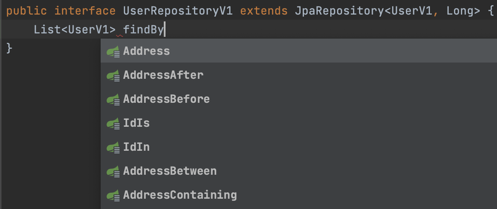
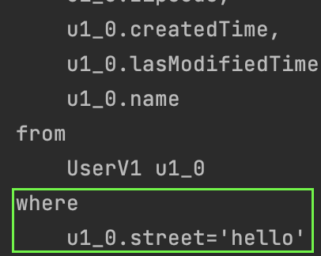

#### spring data jpa
스프링 데이터가 제공하는 마법같은 기능을 알아보자.

#### [쿼리메소드](https://docs.spring.io/spring-data/jpa/docs/current/reference/html/#repositories.query-methods)
`JpaRepository` 인터페이스를 상속하면 놀라운 일이 일어난다.  
규칙을 따르기만 하면 메서드명을 추천해준다.  

규칙은 간단하다.  
`Repository`를 상속하는 인터페이스를 만들기만 하면 된다.  
우리는 jpa를 사용하기 때문에 `Repository`를 상속한 `JpaRepository`를 사용하면 편하다.  
메서드명 추천은 꽤나 고도화되어있다. 아래의 기능도 전부 가능하다.

~~~java
public interface UserRepositoryV1 extends JpaRepository<UserV1, Long> {
    List<UserV1> findByNameAndAddressCity(String name, String city);
    long countUserByName(String name);
    @Transactional
    void deleteUserByName(String name);
}
~~~

쿼리메소드는 크게 `주어(subject)`부분과 `서술어(predicate)`부분으로 구성되어있다.  
각 부분에 들어갈 수 있는 단어들은 [공식문서](https://docs.spring.io/spring-data/jpa/docs/current/reference/html/#repository-query-keywords)를 참고하자.

#### 페이징
페이징 처리도 간단하다.  
위의 에시에서 `findByNameAndAddressCity`에 페이징기능을 추가하고 싶다면 메서드에 `Pageable` 파라미터를 추가하면 된다.

~~~java
List<UserV1> findByNameAndAddressCity(String name, String city, Pageable pageable);
~~~

`Pageable`에는 `Sort`도 같이 들어있다. 정렬을 사용해야 한다면 아래와 같이 해보자.  
~~~java
List<UserV1> findByNameAndAddressCity(String name, String city, Pageable pageable);
~~~

아래와 같이 반환타입을 `Page`로 하면 전체 `count` 쿼리도 자동으로 한번 더 수행하게 된다.  
필요에 따라 반환타입을 적절히 사용하며 된다.

~~~java
Page<UserV1> findByNameAndAddressStreet(String name, String street, Pageable pageable);
~~~

#### NoRepositoryBean
여러 레포지토리가 같은 메서드를 사용해야 하는 경우가 있을 수 있다.  [참조](https://docs.spring.io/spring-data/jpa/docs/current/reference/html/#repositories.definition-tuning)
그럴 때에는 아래와 같이 공통 인터페이스를 만들어서 상속하여 사용할 수 있다.  

~~~java
@NoRepositoryBean
public interface MyBaseRepositoryV2<T, ID> extends JpaRepository<T, ID> {
    Optional<T> findById(ID id);
}

public interface UserRepositoryV2 extends MyBaseRepositoryV2<UserV1, Long> {
}
~~~

#### @Query
jpa가 자동으로 만들어주는 쿼리의 기능은 꽤나 고도화되어있지만, 개발자가 원하는 방향과 다를 수 있다.  
이럴 때에 `@Query`를 사용하여 원하는 쿼리를 직접 만들어둘 수 있다.  
아래의 메서드명은 city로 찾지만 `@Query`에는 `street`으로 찾도록하였다.  
실제 쿼리는 `@Query`를 우선하여 `street`을 기준으로 찾게된다.

~~~java
@Query("select u from UserV1 u where u.address.street = :street")
List<UserV1> findByAddressCity(@Param("street") String street);

// test code
@Test
void queryAnnotation() {
    List<UserV1> users = userRepositoryV2.findByAddressCity("hello");
}
~~~

#### QueryRewriter
jpa가 만들어주는 쿼리가 의도대로 동작하지 않아 `@Query` 혹은 다른 수단을 써서 설정하였는데 끝까지 안되는 경우도 있을 것이다.  
이런 경우에 `QueryRewriter`를 고려해볼 수 있다.

~~~java
public interface UserRepositoryV3 extends JpaRepository<UserV1, Long> {
    @Query(
        value = "select my_user from UserV1 my_user where my_user.name = :name",
        queryRewriter = MyQueryRewriter.class
    )
    List<UserV1> findByName(@Param("name") String name);
}

public class MyQueryRewriter implements QueryRewriter {
    @Override
    public String rewrite(String query, Sort sort) {
        return query.replaceAll("my_user", "my_new_user");
    }
}
~~~

#### [사용자 정의 레포지토리](https://docs.spring.io/spring-data/jpa/docs/current/reference/html/#repositories.custom-implementations)
jpa가 제공해주는 쿼리메소드 자동생성 이외에도 개발자의 의도대로 작동하는 로직이 필요할 수 있다.  
그럴떄에 사용자정의 레포지토리를 따로 만들고 이를 편하게 사용할 수 있다.  

먼저 아래와 같이 인터페이스를 하나 생성하고 이를 상속하여 클래스를 생성한다.  
그리고 원래의 `UserRepositoryV4`에서 사용자정의 인터페이스를 상속받도록 하면 된다.

~~~java
// step1
public interface CustomizedUserRepository {
    void customMethod(UserV1 user);
}

// step2
@Slf4j
@Repository
@RequiredArgsConstructor
public class CustomizedUserRepositoryImpl implements CustomizedUserRepository{

    @PersistenceContext
    private final EntityManager entityManager;

    @Override
    public void customMethod(UserV1 user) {
        // logic...
        log.info("user: {}", user.getName());
    }
}

// step3
public interface UserRepositoryV4 extends JpaRepository<UserV1, Long>, CustomizedUserRepository {
}
~~~
