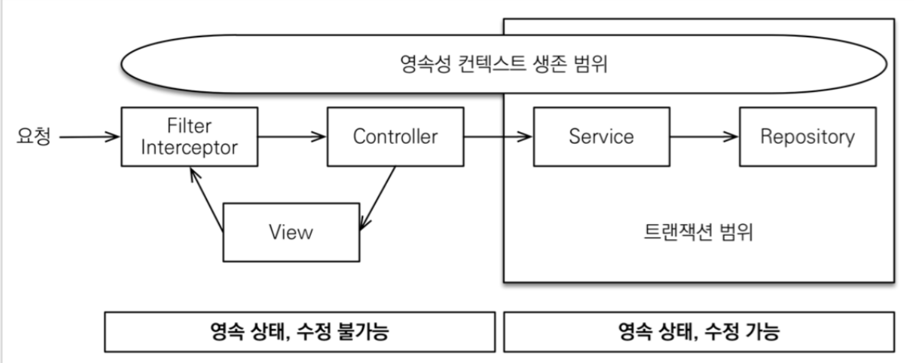

#### osiv
스프링에서는 `osiv`의 기본세팅이 `true`이다.  
`osiv`의 개념을 알아보기 위해 `false`로 변경하고 아래와 설명을 보자.

`spring.jpa.open-in-view=false`

#### 스프링에서의 영속성 컨텍스트
스프링 컨테이너는 기본적으로 트렌젝션 범위내에서 영속성 컨텍스트가 존재한다.  
트렌젝션이 시작할 때에 영속성 컨텍스트를 생성하고, 트렌젝션이 종료될 때에 영속성 컨텍스트를 종료한다는 의미이다.  
그리고 같은 트렌젝션 안에서는 전부 같은 영속성 컨텍스트를 이용한다는 의미이기도 하다.  
이에 따라 주의해서 사용할 부분이 있는데 하나씩 알아보자.

#### 지연로딩
트렌젝션 범위의 영속성컨텍스트와 `지연로딩`이 결합되면 개발자가 의도한대로 동작하지 않고 오류가 발생할 수 있다.  
예시를 테스트해보자.  

테스트용으로 간단한 엔티티 2개를 생성하자.  
`schdule` 엔티티에서 `member` 엔티티를 참조하고 있고 `지연로딩`으로 설정해두었다.  
(`@ManyToOne`이므로 디폴트는 즉시로딩이다.)

~~~java
@Entity
public class MyMemberV1 {
    @Id
    @GeneratedValue(strategy = GenerationType.IDENTITY)
    @Column(name = "MEMBER_ID")
    private Long id;

    private String name;
}

@Entity
public class MyScheduleV1 {
    @Id
    @GeneratedValue(strategy = GenerationType.IDENTITY)
    @Column(name = "SCHEDULE_ID")
    private Long id;

    @ManyToOne(fetch = FetchType.LAZY)
    private MyMemberV1 member;
}
~~~

이제 문제 시나리오를 만들어보자.  
주목해서 볼 부분은 서비스에서 `@Transactional`이고, (`B` 부분)  
컨트롤러에서는 `schedule`에서 `member` 엔티티의 `name`을 조회하는 부분이다. (`A` 부분)  

~~~java
@Controller
@RequiredArgsConstructor
@Slf4j
public class MyControllerV1 {
    private final MyServiceV1 myServiceV1;

    @GetMapping("schedule/{scheduleNo}")
    public void getSchedule(@PathVariable("scheduleNo") Long scheduleNo) {
        MyScheduleV1 schedule = myServiceV1.getSchedule(scheduleNo);
        log.info("member name: {}", schedule.getMember().getName()); // A
    }
}

@Service
@RequiredArgsConstructor
public class MyServiceV1 {
    private final MyScheduleV1Repository myScheduleV1Repository;

    @Transactional // B
    public MyScheduleV1 getSchedule(Long scheduleNo) {
        return myScheduleV1Repository.findById(scheduleNo).get();
    }
}
~~~

##### 오류발생
위의 코드에서 컨트롤러로 `getSchedule()`을 호출하면 `A`지점에서 아래와 같은 오류가 발생한다.

`org.hibernate.LazyInitializationException: could not initialize proxy [com.study.jpa.ch3.v1.entity.MyMemberV1#4] - no Session`

발생항 이유는 위에서 설명한 영속성 컨텍스트의 생명주기가 트렌젝션의 시작과 끝과 동일하기 때문이다.  
위에서 영속성 컨텍스트의 주기는 서비스의 `@Transactional`을 기준으로 아래와 같다.

~~~java
@Transactional // B
public MyScheduleV1 getSchedule(Long scheduleNo) {
    // 영속성 컨텍스트 생성
    return myScheduleV1Repository.findById(scheduleNo).get();
    // 영속성 컨텍스트 종료
}
~~~

영속성 컨텍스트가 종료되었으므로, `A`단계에서 `member`는 `준영속상태`이다.
영속성 컨텍스트가 종료된 준영속상태에서 `getName()`으로 지연로딩을 시도하여 오류가 난 것이다.

#### osiv
스프링은 이를 `osiv`를 통해서 해결한다.  
`osiv`의 동작은 간단하게 요약하여 아래와 같다.

~~~
- 영속성 컨텍스트의 생명주기는 트렌젝션이 아닌 웹 요청을 단위로 한다. 따라서, 웹 요청이 들어오고 리턴될때까지 영속성 컨텍스트는 유지된다.
- 트렌젝션 단위로 flush()를 호출하여 데이터베이스에 반영한다. 이는 osiv의 특성은 아니지만 아래 세번째 특성과 대조를 위해 적는다.
- 트렌젝션이 걸려있지 않더라도 영속성 컨텍스트가 살아있으므로 준영속상태가 아닌 영속상태가 유지되며 객체탐색(지연로딩 포함)이 가능하다.
~~~

`osiv`의 특성을 그림으로 보자면 아래와 같다.  

`osiv`를 켜고 위의 코드를 다시 수행해보자.

오류가 발생했던 `A`에서 정상적으로 로그를 찍는다.  
영속성 컨텍스트가 트렌젝션과 관계없이 유지되기 때문에 가능하다.  
개발자 입장에서는 잘 동작할 것으로 기대하는 `지연로딩`이 정상적으로 동작하니 매우 편리하다고 할 수 있다.  

만약 `osiv`를 사용하지 않았더라면 어떻게 해결해야 했을까?  

`즉시로딩`을 세팅해야 했을 것이다.  
`즉시로딩`을 세팅하는 방법은 여러가지를 공부하였다.  
`jpql`의 `fetch`를 이용할 수 있고, `FetchType=EAGER`으로 설정할 수도 있다.  
혹은 `Hibernate.initialize()` 메서드를 이용할수도 있다.  
하지만 `즉시로딩`을 설정하는 것은 좋은 방법이 아님을 이미 공부하였다.       

##### osiv 주의사항
트렌젝션이 끝나더라도 `지연로딩`이 가능하고, 엔티티를 변경한다 하더라도 데이터베이스에 반영되지 않는 안전한 `osiv`이라 할지라도 주의할 점은 있다.    
아래의 코드에서 `A, B` 부분을 보자.  
위의 예시에서 확인했듯 A에서는 영속성 컨텍스트만 유지될 뿐 실제 데이터베이스로 flush()하지 않아 안전한 것을 확인하였다.  

그러나 `B`의 로직이 추가되면 얘기가 달라진다.  
영속성 컨텍스트가 계속 유지되기 때문에 `B`의 로직이 끝나면 `flush()`가 수행된다.  
그리고 `member` 엔티티도 변경사항이 감지되어 데이터베이스에 `update`가 수행될 것이다.  
생각해보면 너무 당연하지만 반드시 아래 부분을 알고 개발해야 할 것이다.

~~~java
@GetMapping("schedule/{scheduleNo}")
public void getSchedule(@PathVariable("scheduleNo") Long scheduleNo) {
    MyScheduleV1 schedule = myServiceV1.getSchedule(scheduleNo);
    log.info("member name: {}", schedule.getMember().getName()); / A
    myServiceV1.anotherTransactionLogic(); / B
}
~~~

#### reference
https://www.baeldung.com/spring-open-session-in-view