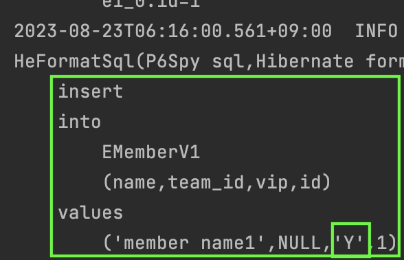

#### Converter
컨버터를 사용하여 엔티티의 데이터를 편하게 관리해보자.  
예를들어 데이터베이스의 `Y/N`으로 저장하는 값을 자동으로 `boolean` 타입으로 변환해서 관리할 수 있다.  

`회원` 엔티티에서 `vip 여부`필드를 컨버터를 통해 테스트해보자.  

컨버터를 만들자.

~~~java
@Converter
public class BooleanToYnConverter implements AttributeConverter<Boolean, String> {
    @Override
    public String convertToDatabaseColumn(Boolean attribute) {
        return (attribute != null && attribute) ? "Y" : "N";
    }

    @Override
    public Boolean convertToEntityAttribute(String vipYn) {
        return "Y".equals(vipYn);
    }
}
~~~

그리고 `회원` 엔티티의 `vip 여부` 필드에 세팅해보자.

~~~java
@Entity
public class EMemberV1 {
    ...

    @Convert(converter = BooleanToYnConverter.class)
    private boolean vip;
}
~~~

데이터를 저장해보자.

~~~java
EMemberV1 member1 = new EMemberV1(1L, "member name1", true);
eMemberRepositoryV1.save(member1);
~~~

수행되는 `sql`을 확인하자.

컨버터 설정은 클래스 단위에도 가능하다.  
다만 이 경우는 `attributeName`를 통해 어떤 필드에 컨버터를 적용할지 명시하면 된다.  
아무래도 필드에 직접 설정하는게 더 직관적이고 좋은 것 같다.

~~~java
@Convert(converter = BooleanToYnConverter.class, attributeName = "vip")
public class EMemberV1 {
    ...
}
~~~

모든 엔티티에서 이 컨버터를 사용하고 싶을 수 있다.  
그럴때는 아래와 같이 컨버터에서 `autoApply`로설정하면 된다.

~~~java
@Converter(autoApply = true) // *
public class BooleanToYnConverter implements AttributeConverter<Boolean, String> {
~~~