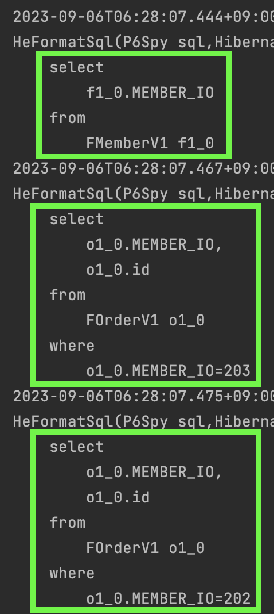
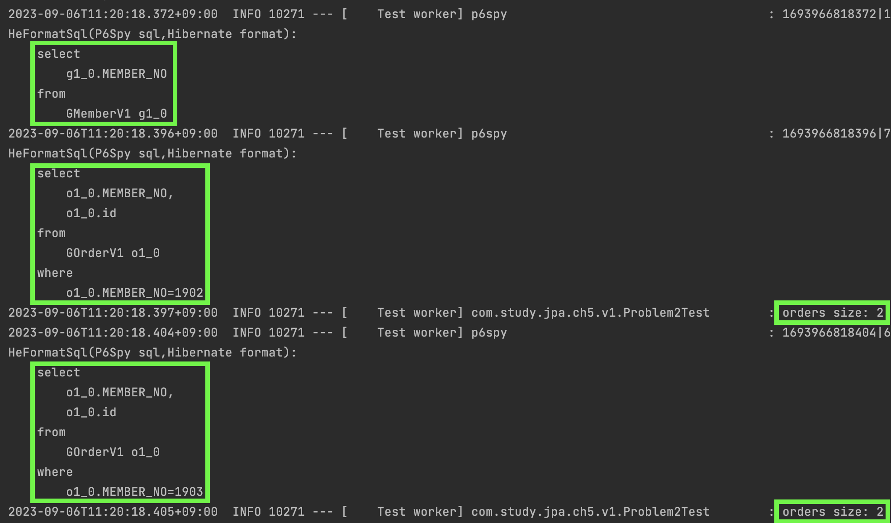
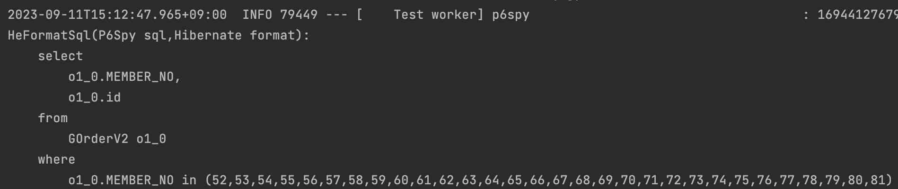
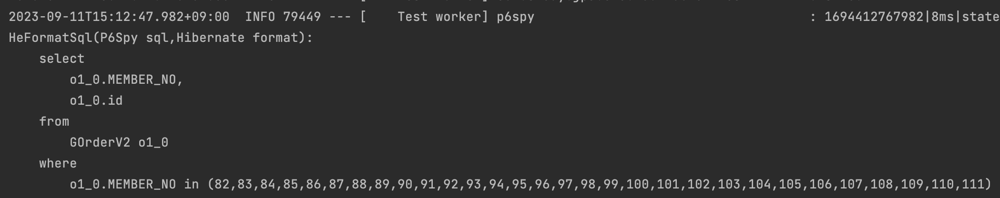
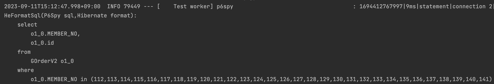
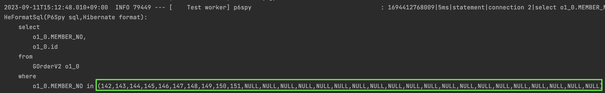
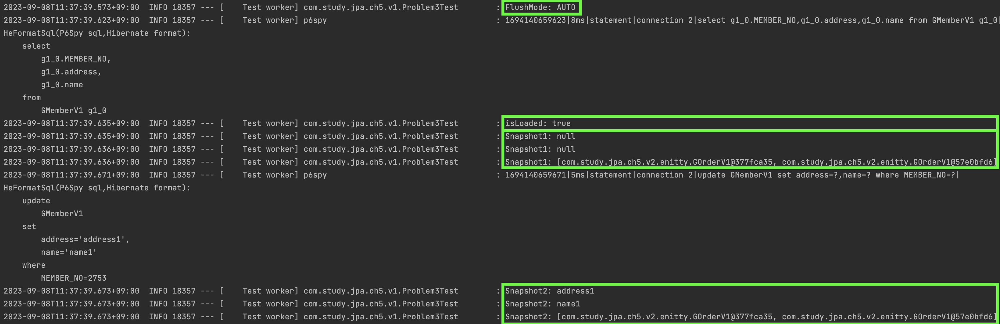
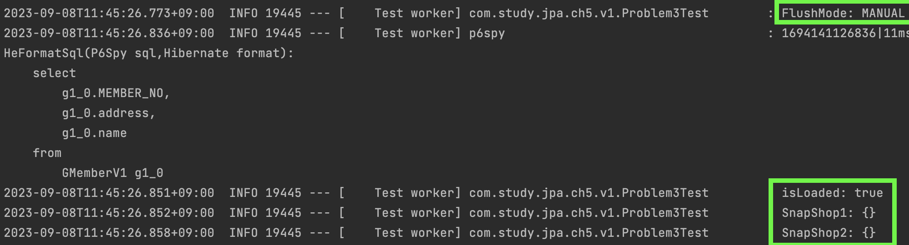

#### 성능최적화
jpa를 사용하면서 직면하게되는 다양한 문제들을 미리 학습해보자.  

##### N+1 문제
N+1 문제는 성능상 가장 주의해야하는 문제중 하나이다.  
예시로 먼저 살펴보자.  

~~~java
@Entity
public class FMemberV1 {
    @Id
    @GeneratedValue(strategy = GenerationType.AUTO)
    @Column(name = "MEMBER_NO")
    private Long id;

    @OneToMany(mappedBy = "member", fetch = FetchType.EAGER)
    private List<FOrderV1> orders;
}

@Entity
public class FOrderV1 {
    @Id
    @GeneratedValue(strategy = GenerationType.AUTO)
    private Long id;

    @ManyToOne
    @JoinColumn(name = "MEMBER_NO")
    private FMemberV1 member;
}
~~~

`회원`과 `주문` 엔티티이고 `1:N`의 평범한 관계이다.  
이미 공부했듯이 `@OneToMany`는 `지연로딩`이고, `@ManyToOne`은 `즉시로딩`이 jpa 기본정책이다.  
그리고 테스트를 위해 `회원` 엔티티의 `@OneToMany`에 `즉시로딩`을 설정하였다.

그리고 아래와 같이 jpql 쿼리를 만들어보자.  

~~~java
public interface FMemberRepositoryV1 extends JpaRepository<FMemberV1, Long> {
    @Query("select m from FMemberV1 m")
    List<FMemberV1> findMembers();
}
~~~

이제 위의 조건을 수행해보자.

~~~java
@Test
void problem1() {
    List<FMemberV1> members = fMemberRepositoryV1.findMembers();
}
~~~

위의 테스트코드에서는 몇 번의 `select` 문이 실행될까?  
`회원` 테이블에 2개의 데이터가 들어있다고 가정해보고 생각해보라.  

총 3번이 수행된다.    
jpql에서 `m` 값만을 조회했으니 첫번째 `select`에서는 회원만 전체조회를 하게 된다.  
그리고 두번째 `select`에서는 첫번쨰 쿼리에서 얻은 `첫번째 회원`의 키값으로 `주문`을 하나 조회한다. `(MEMBER_NO=203)`  
그리고 세번째 `select`에서는 첫번째 쿼리에서 얻은 `두번째 회원`의 키값으로 `주문`을 하나 조회한다. `(MEMBER_NO=202)`  

어차피 키값으로 조회하는 것이고 그래봐야 세번의 조회이니 별 문제가 없어보일 수 있다.  
하지만 `회원테이블`에 `수천, 수만개`의 데이터가 들어있다면 `수천+1, 수만+1 개`의 `select`가 수행될 수 있다.  

이처럼 `즉시로딩`과 jpql를 같이 하게 될때에 N+1의 문제가 발생할 수 있다.  

그러면 `지연로딩`으로 바꾸면 해결되는가?  
그런것처럼 보인다. `회원`만 전체조회하고 `주문`은 실제 조회가 있을떄에 `select`가 수행될 것이기 때문이다.  

그렇다면 아래와 같은 로직이 있다고 가정해보자.  

~~~java
@Test
@Transactional
void problem1() {
    List<GMemberV1> members = gMemberRepositoryV1.findMembers();
    members.forEach(member -> {
        List<GOrderV1> orders = member.getOrders();
        log.info("orders size: {}", orders.size());
    });
}
~~~

똑같이 `회원` 테이블에 `2`개의 데이터가 들어있었다고 가정하면 `3`개의 `select`가 수행된다.  

똑같은 수의 쿼리가 수행되나(`N+1` 문제가 그대로 유지되지만) 그래도 이 상황은 `즉시로딩` 상황보다는 낫다고 생각한다.    
적어도 개발자가 `N+1` 문제가 발생할 것이라고 생각할 가능성이 높기 때문이다.  

#### 해결방안1
`N+1 문제`가 발생했다고 어떻게 기술적으로 해결할 지 생각하기보다는,  
`특정 엔티티(1)`로부터 `연관 엔티티(N)`의 조회로직이 얼마나 빈번하게 발생하는지 생각해보라.  
`특정 엔티티`로부터 `연관 엔티티`를 매번 조회해야 한다면 그냥 `즉시로딩`을 설정하면 된다.   
`즉시로딩`을 지양하라고 해서 쓰지 말라는 것이 아니다. 바로 이럴때에 `즉시로딩`을 설정하라는 것이다.  

`특정 엔티티`로부터 `연관 엔티티`로의 조회가 반반의 확률이라면 어떨까?  
그러면 `지연로딩`으로 설정하고, 다른 방법을 찾자.  
가장 많이 쓰는 방법은 jpql에서 `fetch`를 사용하도록 변경하는 것이다.  

`특정 엔티티`로부터 `연관 엔티티`를 조회하지 않는 로직이면 `지연로딩`을 사용하면 되고,  
`연관 엔티티`를 조회해야하는 로직이면 `fetch`를 사용한 jpql을 사용하면 된다.  
`같은 엔티티`의 조회이지만 `2개의 메서드`가 있는것이 껄끄럽지만 성능최적화를 위해 감수할만한 상황이 있을 것이다.  

#### 해결방안2
목적에 따라 `지연로딩, 즉시로딩` 두 가지 메서드를 운영하는게 번거롭다면, `@BatchSize` 어노테이션을 사용해볼 수 있다.  
아래와 같이 `지연로딩`이 설정되어 있는 부분에 `@BatchSize`를 걸어보자.  
`회원`의 데이터가 `100`개가 들어있다고 가정하고, 이 어노테이션이 없는채로 `회원엔티티`를 전체조회하고 `주문엔티티`를 하나씩 탐색한다면   
총 `101`개의 `select`가 발생할 것이다. (아래의 테스트코드 참조)

~~~java
@Entity
public class GMemberV2 {
    ...
    
    @OneToMany(mappedBy = "member")
    @BatchSize(size = 30)
    private List<GOrderV2> orders;
}
~~~

해당 어노테이션을 설정하고 아래의 테스트코드를 수행하고 로그를 살펴보자.

~~~java
// repository
public interface GMemberRepositoryV2 extends JpaRepository<GMemberV2, Long> {
    @Query("select m from GMemberV2 m")
    List<GMemberV2> findMembers();
}

// 테스트 코드
@Test
@Transactional
void problem1() {
    List<GMemberV2> members = gMemberRepositoryV2.findMembers();
    log.info("members: {}", members);

    for (GMemberV2 member : members) {
        List<GOrderV2> orders = member.getOrders();
        log.info("size: {}", orders.size());
    }
}
~~~

로그는 아래와 같다.

`100`개의 데이터를 `30`개씩 조회하였으니 총 `4`번의 쿼리가 수행되는것이 이해가 된다.  
그래도 마지막 수행된 쿼리는 주목할 필요가 있다.  
`IN`절에 주문 엔티티의 `10`개의 키값과 `NULL 20`개가 들어있기 때문이다.

이유는 `prepared statement` 재활용에 있다.  
만약 `IN` 절에 깔끔하게 남은 `10`개의 키값만 들어있으면 `IN`에 `10`개의 키값이 들어가는 `prepared statement`를 보관해야 한다.  
만약 데이터가 `95`개였다면 `IN`절에 `5`개의 키값이 들어가는 `prepared statement`를 보관해야 했을 것이다.  
그렇다면 결과적으로 `30`개의 `prepared statement`를 보관해야 한다.  
만약 `@BatchSize(size = 1000)`라면 `1000`개의 `prepared statement`를 보관해야 했을 것이다.  
이러한 전략보다는 차라리 `NULL`을 채워서 하나의 `prepared statement`만 관리하도록하는 hibernate의 전략이다.   

#### 읽기전용 쿼리의 성능 최적화
엔티티를 영속성 컨텍스트에서 관리한다는것은 여러가지 이점이 있다.  
`1차 캐시기능`을 하여 실제 데이터베이스와의 통신 횟수를 줄여 성능상 이점을 얻을 수도 있고,   
`변경감지기능`을 통해 손쉽게 엔티티 변경을 할 수도 있다.  

그러나 이것의 또 다른 의미는 영속성 컨텍스트가 메모리에 계속해서 올라가있다는 것이다.   
실제 어플리케이션에서는 수백, 수천의 엔티티가 여러 쓰레드에서 생기고 사라지기를 반복하면서 관리될 것이다.    
만약 빈번하게 호출되는 로직중 하나가 수만개의 엔티티를 조회한다면 메모리관리에 굉장한 부담이 될 수 있다.  

또한, 실제로 영속성 컨텍스트에는 엔티티의 값만 관리되는 것이 아니다.  
`변경감지기능`이란 엔티티의 스냅샷을 저장해두고 변경데이터를 계속해서 비교한다는 것이다.  
이것의 의미는 스냅샷도 계속 관리하는 부담이 있다는 것이다.   

많은 수의 엔티티를 조회하는 로직이 조회의 기능만 필요하고 수정로직이 없다면 엔티티조회를 `읽기전용`으로하여 성능을 최적화해볼 수 있다.      
`읽기전용`으로 설정하면 어떤 이점이 있는지도 아래에서 살펴보자.

아래의 jpql문을 최적화해보자.  

~~~sql
select m from GMemberV1 m
~~~

##### 스칼라 타입으로 조회 
아래와 같이 스칼라 타입으로 변경한다면 영속성컨텍스트에 등록되지 않을 것이다.  
하지만 리턴타입을 `Object[]`으로 받아야한다.    
컨버터를 사용하여 한번 더 변환을 해주어야하는 번거로움은 있을 것이다.  
~~~java
@Query("select m.id, m.name, m.address from GMemberV1 m")
List<Object[]> findMembersByColumns();
~~~

##### 스프링 @Transactional(readOnly = true) 사용
스프링 readOnly를 사용하면 jpa에서는 어떻게 동작할까?    
메모리부담을 덜어줄 수 있을까?    

결론적으로는 아래와 같은 논리에 의해 메모리부담이 적어진다.  
~~~
- 엔티티의 스냅샷은 결국 엔티티의 변경사항을 추출하기위한 용도이다.  
- 변경사항을 추출하는 목적은 데이터베이스의 변경사항을 반영하기 위함이다.  
- readOnly는 데이터에 변경사항을 반영할 필요가 없다.  
- 따라서 스냅샷을 저장하지 않아도 된다.
- 스냅샷을 저장하지 않으니 메모리부담이 적어진다.   
~~~

이를 코드로 확인해보자.

~~~java
@Test
@Transactional
//    @Transactional(readOnly = true)
void problem1() {
    SharedSessionContractImplementor sharedSessionContractImplementor = entityManager.unwrap(SharedSessionContractImplementor.class);
    log.info("FlushMode: {}", sharedSessionContractImplementor.getHibernateFlushMode());

    org.hibernate.engine.spi.PersistenceContext persistenceContext = sharedSessionContractImplementor.getPersistenceContext();
    List<GMemberV1> members = gMemberRepositoryV1.findMembersByColumns();
    for(GMemberV1 member : members) {
        log.info("isLoaded: {}", entityManager.contains(member));
    }
    
    members.forEach(member -> {
        EntityEntry entity = persistenceContext.getEntry(member);

        // check snapshot 1
        Object[] states = entity.getLoadedState();
        if (states != null) {
            Arrays.stream(states).forEach(o -> log.info("Snapshot1: {}", o));
        } else {
            log.info("SnapShop1: {}", states);
        }

        // update
        member.setName("name1");
        member.setAddress("address1");

        // flush
        entityManager.flush();

        // check snapshot 2
        states = entity.getLoadedState();
        if (states != null) {
            Arrays.stream(states).forEach(o -> log.info("Snapshot2: {}", o));
        } else {
            log.info("SnapShop2: {}", states);
        }
    });
}
~~~

첫번쨰 볼 부분은 `FlushMode=AUTO`이다. 이는 트렌젝션이 끝날때에 혹은 강제로 `flush()`가 호출될때에 `flush()`가 호출되는 정책이다.  
두 번째는 `isLoaded=true`이다. 지금은 `readOnly` 설정이 안되어서 당연히 영속성 컨텍스트에 등록되는것이 맞지만 아래에서 `readOnly` 설정을 했을때에 바뀌는지도 주목해보자.  
그리고 최초로 불러온 `name`과 `address`가 비어있는 `member` 엔티티의 스냅샷을 저장하는 것을 볼 수 있고,  
값을 변경했을 때에 `update`문이 호출되고(정확하게는 쓰기지연 저장소에 저장되고) 스냅샷의 정보도 변경되는것을 같이 확인할 수 있다.  

이제 `readOnly`를 켜고 다시 수행해보자.  

 

`FlushMode=MANUAL`로 바뀌었다. 이는 강제로 `flush()`가 호출되지 않는이상 `flush()`는 트렌젝션이 끝나더라도 자동으로 수행되지 않는 정책이다.  
이는 트렌젝션 내에서 엔티티의 정보를 변경해도 나중에 `flush()`가 호출되지 않기 때문에 안전하게 하기도 한다.  
그리고 `flush()`를 강제로 호출한다 하더라도 아예 처음부터 스냅샷을 저장하지 않기 때문에 `flush()`를 한다해도 변경사항을 반영할 것이 없는 상태이다.  

`isLoaded`는 `readOnly`여부와 관계없이 영속성 컨텍스트에 등록은 하는것을 보여준다.  
이 의미는 나중에 알아보자.

