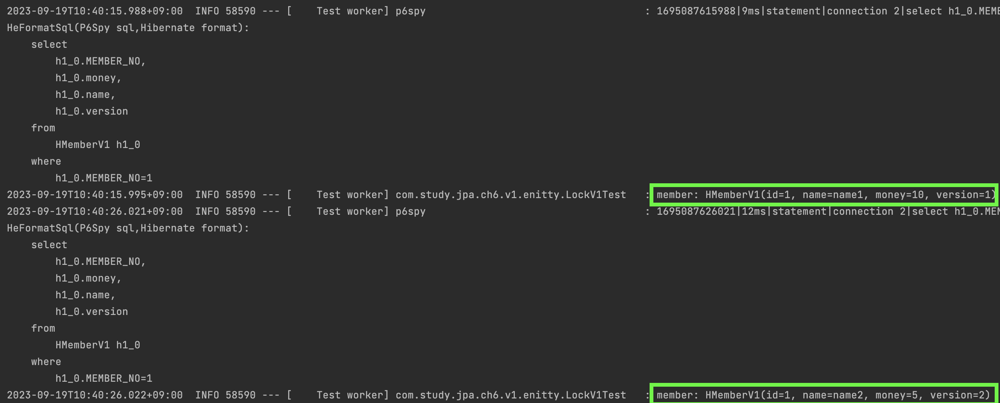

#### Lock
jpa가 제공하는 락에 대해서 공부해보자.  
어플리케이션의 트레픽이 많아지다보면 같은 데이터에 대해서 동시에 변경하려는 요청이 들어올 수 있다.  
아무런 설정도 하지 않는다면 뒤에 커밋한 트렌젝션이 반영될 것이다.  
이것이 개발자가 의도한 동작이라면 상관없지만 그렇지 않다면 문제가 발생할 수 있다.  

가장 흔한 은행인출 예시를 생각해보자.  
두 트렌젝션은 통장에 `1만원`이 있다고 동시에 조회하였고, 동시에 `1만원`을 인출한다면 결국에는 통장에 `마이너스 1만원`이 남게 될 것이다.  
jpa에서 이를 다루는 방법을 알아보자.  

#### @Version
엔티티에 `@Version` 어노테이션을 붙이면서 이를 해결해 볼 수 있다.  
이렇게 하면 실제 테이블에도 `version`이라는 컬럼이 있어야 한다.  
`version` 컬럼이 추가된 만큼 이 방식은 `version`을 기반으로 동작한다.  
하나의 데이터가 들어있고 `version=1` 이라고 가정하자.  
그리고 데이터가 변경되면 `version`도 같이 `1`씩 올리게 된다.  
만약 두개의 쓰레드가 동시에 데이터변경을 하려했다면 아래와 같은 로그와 실패오류를 확인할 수 있다.  

테스트코드는 아래와 같다.

~~~java
@Test
@Transactional
void lock1() throws Exception {
    HMemberV1 member = hMemberRepositoryV1.findById(1L).get();
    log.info("thread: {}, member: {}", Thread.currentThread().getName(), member);
    member.setMoney(member.getMoney() - 5);

    // update on query browser

    Thread.sleep(5000);
}
~~~

로그는 아래와 같다.

 
맨 위의 쿼리는 `findById()`로 인해 수행된 것이고, `두번째와 세번째 쿼리`를 주목할 필요가 있다.    
`두번째 쿼리`에서 `update`시에 `set`과 `where` 조건에서 `version`으로 조회하고 `1`을 증가시키는 부분을 볼 수 있다.  
그리고 세번째로 `select`가 다시 수행되는데 이 부분이 중요하다.  
`commit`을 하기 전에 `version`이 `8`이 맞는지 확인하는 것이다.  
그리고 해당 데이터가 다른 쓰레드에 의해 `8`에서 `9`값으로 증가되었기 때문에 그 아래에 `ObjectOptimisticLockingFailureException` 오류가 발생했다.  
이렇게 동작한다면 위에서 예시로 든 `두 번의 인출문제`를 해결 할 수 있다.  
동시에 같은 `versino`을 조회했어도 먼저 `commit` 한 것이 반영되고, 다른 하나는 실패하는 전략이다.  

또한 이 정도의 락 설정은 `NON-REPEATABLE READ`가 발생하는것도 알고 있어야 한다. (락 수준이 높다고 좋은것은 아니다. 개발자의 의도대로 작동하면 된다.)  
한 트렌젝션 내에서 같은 읽기의 결과값이 다를 수 있는 것이다.  

`NON-REPEATABLE READ`은 아래와 같이 쉽게 재현해볼 수 있다.  
다만 `isolation level`이 `READ_COMMITTED`보다는 낮게 설정되어있어야 한다.  

~~~java
@Test
@Transactional(isolation = Isolation.READ_COMMITTED)
void lock2() throws Exception {
    HMemberV1 member = hMemberRepositoryV1.findById(1L).get();
    log.info("member: {}", member);

    // update on query browser
    Thread.sleep(10000);

    // clear
    entityManager.flush();
    entityManager.clear();

    member = hMemberRepositoryV1.findById(1L).get();
    log.info("member: {}", member);
}
~~~
같은 `findById()`이지만 다른 결과값을 아래 로그에서 확인할 수 있다.

