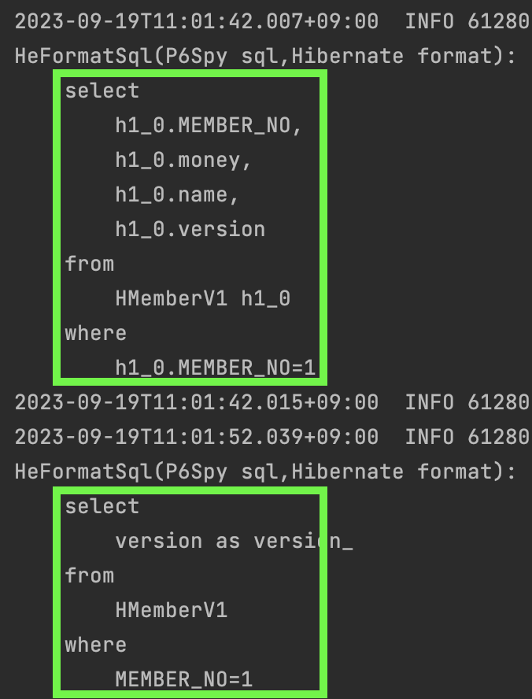
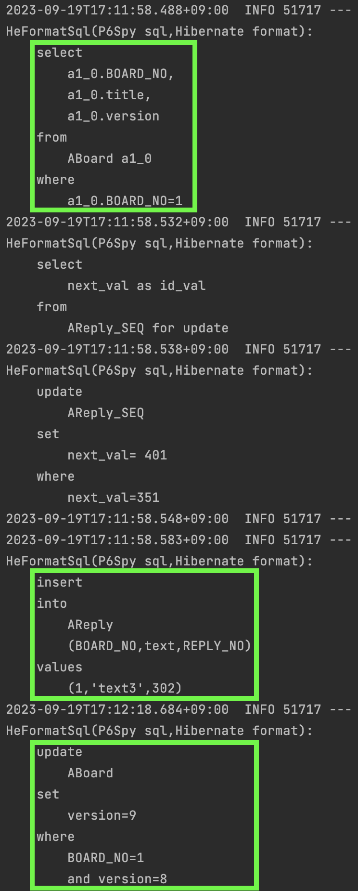

#### Lock
jpa가 제공하는 락에 대해서 공부해보자.  
어플리케이션의 트레픽이 많아지다보면 같은 데이터에 대해서 동시에 변경하려는 요청이 들어올 수 있다.  
아무런 설정도 하지 않는다면 뒤에 커밋한 트렌젝션이 반영될 것이다.  
이것이 개발자가 의도한 동작이라면 상관없지만 그렇지 않다면 문제가 발생할 수 있다.  

가장 흔한 은행인출 예시를 생각해보자.  
두 트렌젝션은 통장에 `1만원`이 있다고 동시에 조회하였고, 동시에 `1만원`을 인출한다면 결국에는 통장에 `마이너스 1만원`이 남게 될 것이다.  
jpa에서 이를 다루는 방법을 알아보자.  

#### @Version
엔티티에 `@Version` 어노테이션을 붙이면서 이를 해결해 볼 수 있다.  
이렇게 하면 실제 테이블에도 `version`이라는 컬럼이 있어야 한다.  
`version` 컬럼이 추가된 만큼 이 방식은 `version`을 기반으로 동작한다.  
하나의 데이터가 들어있고 `version=1` 이라고 가정하자.  
그리고 데이터가 변경되면 `version`도 같이 `1`씩 올리게 된다.  
만약 두개의 쓰레드가 동시에 데이터변경을 하려했다면 아래와 같은 로그와 실패오류를 확인할 수 있다.  

테스트코드는 아래와 같다.

~~~java
@Test
@Transactional
void lock1() throws Exception {
    HMemberV1 member = hMemberRepositoryV1.findById(1L).get();
    log.info("thread: {}, member: {}", Thread.currentThread().getName(), member);
    member.setMoney(member.getMoney() - 5);

    // update on query browser

    Thread.sleep(5000);
}
~~~

로그는 아래와 같다.

 
맨 위의 쿼리는 `findById()`로 인해 수행된 것이고, `두번째와 세번째 쿼리`를 주목할 필요가 있다.    
`두번째 쿼리`에서 `update`시에 `set`과 `where` 조건에서 `version`으로 조회하고 `1`을 증가시키는 부분을 볼 수 있다.  
그리고 세번째로 `select`가 다시 수행되는데 이 부분이 중요하다.  
`commit`을 하기 전에 `version`이 `8`이 맞는지 확인하는 것이다.  
그리고 해당 데이터가 다른 쓰레드에 의해 `8`에서 `9`값으로 증가되었기 때문에 그 아래에 `ObjectOptimisticLockingFailureException` 오류가 발생했다.  
이렇게 동작한다면 위에서 예시로 든 `두 번의 인출문제`를 해결 할 수 있다.  
동시에 같은 `version`을 조회했어도 먼저 `commit` 한 것이 반영되고, 다른 하나는 실패하는 전략이다.  

또한 이 정도의 락 설정은 `NON-REPEATABLE READ`가 발생하는것도 알고 있어야 한다. (락 수준이 높다고 좋은것은 아니다. 개발자의 의도대로 작동하면 된다.)  
한 트렌젝션 내에서 같은 읽기의 결과값이 다를 수 있는 것이다.  

`NON-REPEATABLE READ`은 아래와 같이 쉽게 재현해볼 수 있다.  
다만 `isolation level`이 `READ_COMMITTED`보다는 낮게 설정되어있어야 한다.  

~~~java
@Test
@Transactional(isolation = Isolation.READ_COMMITTED)
void lock2() throws Exception {
    HMemberV1 member = hMemberRepositoryV1.findById(1L).get();
    log.info("member: {}", member);

    // update on query browser
    Thread.sleep(10000);

    // clear
    entityManager.flush();
    entityManager.clear();

    member = hMemberRepositoryV1.findById(1L).get();
    log.info("member: {}", member);
}
~~~
같은 `findById()`이지만 다른 결과값을 아래 로그에서 확인할 수 있다.

#### LockModeType.OPTIMISTIC
`NON-REPEATABLE READ`을 방지할 수 있는 방법은 `LockModeType.OPTIMISTIC` 으로 설정하는 것이다.  
(`LockModeType.READ` 과는 완전 동일한 설정이다.)

설정은 아래와 같이 하면 된다.

~~~java
@Lock(LockModeType.OPTIMISTIC)
HMemberV1 findMemberById(Long id);
~~~

해당 설정을 적용하면 단순 조회만 하더라도 트렌젝션이 끝날때까지 같은 `version` 임을 보장한다.  
따라서 `@Lock` 설정을 하기 위해서는 반드시 `@Version` 어노테이션을 붙일 변수가 존재해야 한다.    
만약 해당 변수가 없다면 아래와 같은 오류가 발생한다.

~~~
org.springframework.orm.jpa.JpaSystemException: Unable to perform beforeTransactionCompletion callback: Cannot invoke "Object.equals(Object)" because the return value of "org.hibernate.engine.spi.EntityEntry.getVersion()" is null
~~~

`LockModeType.OPTIMISTIC`으로 `NON-REPEATABLE READ`가 방지되었는지 아래 테스트코드를 통해 확인해보자.

~~~java
@Test
@Transactional(isolation = Isolation.READ_COMMITTED)
void lock3() throws Exception {
    HMemberV1 member = hMemberRepositoryV1.findMemberById(1L);
    log.info("member: {}", member);

    // update on query browser
    Thread.sleep(10000);
}
~~~

아래의 로그를 보면 `select`가 두번 수행된다.

그리고 아래와 같은 친절한 오류발생 메시지와 함께 데이터베이스에 새로운 `version`이 존재한다는 오류를 던져주고 있다. 

~~~
org.springframework.orm.ObjectOptimisticLockingFailureException: Newer version [3] of entity [[com.study.jpa.ch6.v1.enitty.HMemberV1#1]] found in database
~~~

#### LockModeType.OPTIMISTIC_FORCE_INCREMENT
`LockModeType.OPTIMISTIC_FORCE_INCREMENT`은 단순 조회만 하더라도 `version`을 `1` 증가시킨다.  
어떨 때 사용하는지 알아보자.

~~~java
@Entity
public class ABoard {
    @Id
    @GeneratedValue(strategy = GenerationType.AUTO)
    @Column(name = "BOARD_NO")
    private Long id;

    private String title;

    @OneToMany(mappedBy = "board", cascade = CascadeType.PERSIST)
    List<AReply> replies;

    @Version
    private Integer version;
}

@Entity
public class AReply {
    @Id
    @GeneratedValue(strategy = GenerationType.AUTO)
    @Column(name = "REPLY_NO")
    private Long id;

    private String text;

    @JoinColumn(name = "BOARD_NO")
    @ManyToOne
    private ABoard board;
}

public interface ABoardRepositoryV1 extends JpaRepository<ABoard, Long> {
    @Lock(LockModeType.OPTIMISTIC_FORCE_INCREMENT)
    ABoard findABoardById(Long id);
}
~~~

위의 `게시글`과 `댓글`의 관계는 `1:N`의 관계이다.  
두 개의 동시요청에서 댓글을 작성한다고 가정해보자.  
`게시글`을 변경하는 것이 아니니, `LockModeType.OPTIMISTIC` 옵션이었다면 둘 다 `댓글`이 정상적으로 추가되었을 것이다.  

`LockModeType.OPTIMISTIC_FORCE_INCREMENT` 옵션은 단순 조회만 하더라도 `version`을 증가시킨다고 하였다.  
위의 예시에서는 `게시글`의 `댓글`만 추가해도 `version`이 증가될 것이다.  
실제 `게시글`의 성격은 변한것이 없지만 관련 엔티티의 변경으로 `version`이 증가되는 것이다.  
만약 두 개의 동시요청이 댓글을 추가하려고 한다면 하나는 실패하게 될 것이다.  
둘 중 하나는 `게시글`의 `version`을 확인할때에 실패할 것이기 때문이다.  

테스트코드를 작성하고 확인해보자.  

~~~java
@Test
@Transactional(isolation = Isolation.READ_COMMITTED)
void lock1() throws Exception {
    // board
    ABoard board1 = aBoardRepositoryV1.findABoardById(1L);

    // reply
    AReply reply = new AReply();
    reply.setText("text3");
    reply.setBoard(board1);

    // add reply
    board1.getReplies().add(reply);
}
~~~

일반적으로 `댓글`은 동시에 추가되어도 반영되어야 하기 때문에 위와같은 설정을 하지는 않을 것이다.  
하지만, 분명히 필요한 서비스가 있을 것이고 그럴 때에 유용하게 사용하면 된다.

#### LockModeType.PESSIMISTIC_WRITE
위에서 진행한 여러가지 해결방법들은 데이터베이스의 기능을 이용하는 것이 아니라 jpa에서 논리적으로 해결한 것이다.  
`version` 컬럼을 이용하여 트렌젝션이 끝나기 전에 변경사항을 체크하던지, 데이터 조회 혹은 변경시 `version`을 올리는 방식 등이 있었다.  
`LockModeType.PESSIMISTIC_WRITE`은 데이터베이스의 기능을 사용한다.    
`LockModeType.PESSIMISTIC_READ, LockModeType.PESSIMISTIC_FORCE_INCREMENT`도 있지만 잘 사용하지 않고 데이터베이스에서 지원하지 않는 경우도 있으니 필요시에 따로 보자.  

`LockModeType.PESSIMISTIC_WRITE`은 `select for update`을 사용하여 해결한다.   
`select for update`으로 `X_LOCK`을 설정하니 다른 트렌젝션에서는 해당 범위의 데이터를 수정할 수 없다.    
당연히 `NON-REPEATABLE READ`도 발생할 수 없다.

#### Reference
- https://www.baeldung.com/jpa-pessimistic-locking
- https://www.geeksforgeeks.org/difference-between-shared-lock-and-exclusive-lock/
- https://github.com/eugenp/tutorials/tree/master/persistence-modules/hibernate-jpa/src/test/java/com/baeldung/hibernate/pessimisticlocking
- https://dev.mysql.com/doc/refman/8.0/en/innodb-locking-transaction-model.html
- https://tecoble.techcourse.co.kr/post/2022-11-07-mysql-isolation/
